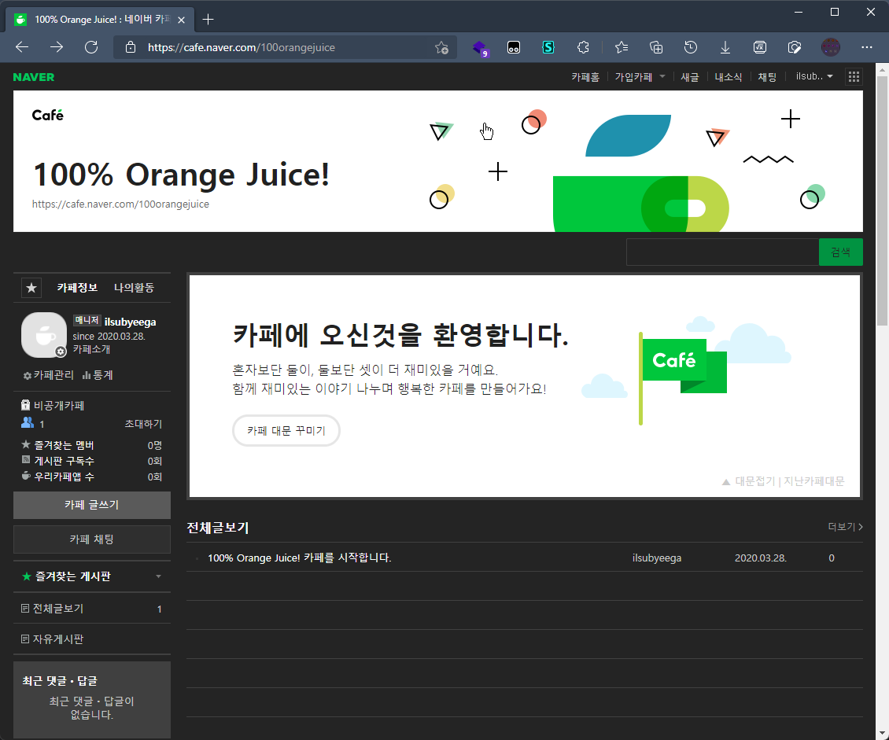
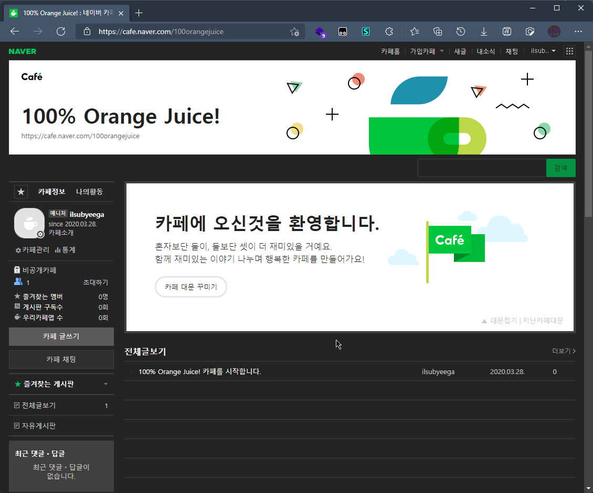
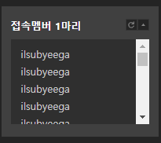
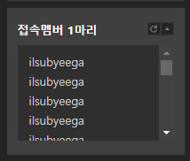

Archived, use edge scrollbar to disable scrollbar etc.

# naver-color-scheme
[DarkenPages/Naver-Dark](https://github.com/DarkenPages/Naver-Dark) 를 위한 일부 트윅입니다.
## 기능들
- color-scheme 변경 (black scrollbar)

## 적용법
DarkenPages/Naver-Dark를 설치 하신 이후, [다음 주소](https://github.com/ilsubyeega/naver-color-scheme/raw/main/naver-color-scheme.user.css)로 이동하셔서 설치하시면 됩니다.

## 스크린샷

